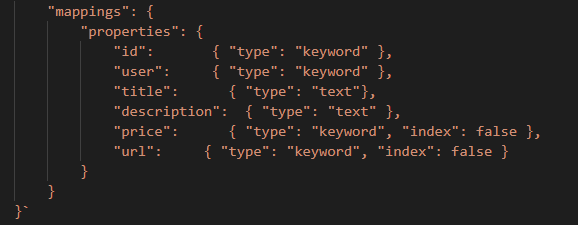
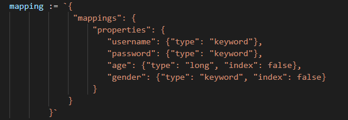

#  Lightweight Web Application Search and Purchase Platform

### *Introduction*

---

### *Developer Environment*

* Frontend

* Backend

---

### *Frontend Software Architecture*

---

### *Backend Software Architecture*

---
### *Backend Software Components (Handler)*

The handler responses for handling specific client request redirected from HTTP router. There is a JWT middleware layer added on top of the handler to verify user
authentication before handling the client request. The user authenication is JWT token based. A generated token will be sent to client once the first time user login is verified. The client request carries the token afterward for verifying the user information. The CORS request is enabled to unblocks cross domain query.

#### UploadHandler

* Parse the HTTP request into App item object
* Call the `SaveApp` from the service layer for futher App uploading actions 

#### SignupHandler
* Parse the HTTP request into user object
* Call the `AddUser` from the service layer for further user registration actions

#### LoginHandler
* Parse the HTTP request into user object
* Call the `CheckUser` from service layer for further user authentication actions

#### SearchHandler
* Parse the HTTP request into title, description and username query string 
* Call the `SearchApp` from service layer for further App searching actions

#### DeleteHandler
* Parse the HTTP request into App item id query string 
* Call the `DeleteApp` from service layer for further App deletion actions

#### CheckoutHandler
* Parse the HTTP request into App item id query string 
* Call the `Checkout` from service layer for further App payment checkout actions

---

### *Backend Software Components (Service)*

#### SaveApp

* Call `CreateAppWithPrice` from backend client layer to create App product id and price id via Stripe API
* Call `SaveToGCS` from backend client layer to save media file for the APP item and create the media file link
* Call `SaveToES` from baclend client layer to save App item metadata

#### AddUser
* Verify the user is not existed
* Call `SaveToES` from baclend client layer to save user information metadata

#### CheckUser
* Call `ReadFromES` from baclend client layer to retrieve user information
* Verify the user password

#### SearchApp
* Provide default search method
* Provide search by username only method
* Provide search by title only method
* Provide search by description only method
* Call `ReadFromES` from baclend client layer to search App items

#### DeleteApp
* It allows to delete only the App items uploaded by the current user 
* Call `DeleteFromES` from baclend client layer to delete App item

#### Checkout
* Call `SearchApp` from current layer to retrieve the App item price id 
* Call `CreateCheckoutSession` from backend client layer to retreive the payment checkout link

---

### *Backend Software Components (Backend Client)*

#### ReadFromES
* Use ElasticSearch backend client object to read data based on input query string and index

#### SaveToES
* Use ElasticSearch backend client object to save data based on input query string and index

#### DeleteFromES
* Use ElasticSearch backend client object to delete data based on input query string and index

#### SaveToGCS
* Use Google Cloud Storage backend object client to save media data

#### CreateAppWithPrice
* Call Stripe API to create App item product id and price id

#### CreateCheckoutSession
* Call Stripe API to retrieve App item payment checkout link based on App item price id

---
### *Database*

* ElasticSearch (ES)
  * NoSQL database  
  * Store user information and App item metadata (app basic information, media file url, product id and price id for payment checkout link query)
  * Create inverted index for App item title and description
  * Support fast keyword search from user input
  
 The following figures show the schema for App item and user information in ElasticSearch (ES):
 
 
 
 
 
  
* Google Cloud Storage (GCS)
  * Blob storage for non-structured data 
  * Store media files for App item
  * Link of each media file is stored as metadata in ElasticSearch (ES)
  
---
 
### *Deployment*

* Frontend
  * Amazon Web Service (AWS) based
  * Deploy frontend build package to AWS Simplify (PaaS)  

* Backend
  * Google Cloud Platform (GCP) based
  * Docker containerization technology
  * Create Dockerfile to include deployment configuration
  * Deploy the backend code package to Google App Engine [GAE] (PaaS)
